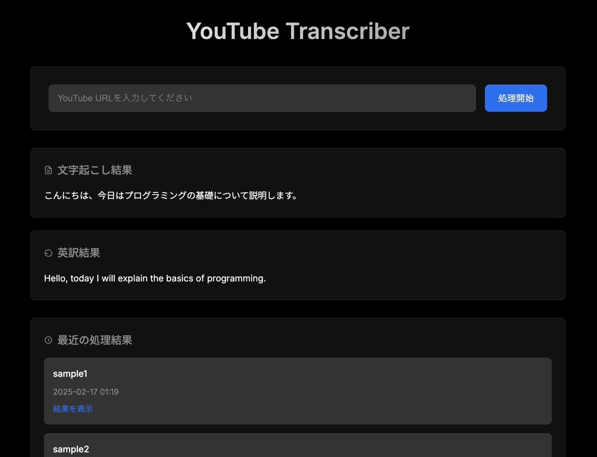

# YouTube Transcriber

YouTubeの動画から文字起こしと翻訳を行うWebアプリケーション



## 機能

- YouTube動画のダウンロード
- 音声の文字起こし（Whisper AI）
- 日本語から英語への翻訳（OpenAI API）
- 結果の保存とMarkdownファイル出力
- タグ付けと検索機能

## セットアップ

1. 必要なパッケージのインストール：
bash
pip install -r requirements.txt

env
OPENAI_API_KEY=your_openai_api_key
SUPABASE_URL=http://127.0.0.1:54321
SUPABASE_KEY=your_supabase_anon_key

4. アプリケーションの起動：
bash
uvicorn app:app --reload --port 8001


## 使用方法

1. ブラウザで`http://localhost:8001`にアクセス
2. YouTube URLを入力
3. 「処理開始」をクリック
4. 文字起こしと翻訳結果が表示される

## API エンドポイント

- `GET /api/videos` - 全ての動画リストを取得
- `GET /api/videos/{youtube_id}` - 特定の動画の情報を取得
- `GET /api/videos/{youtube_id}/full` - 動画の詳細情報（タグ、ログを含む）を取得
- `GET /api/tags` - 全てのタグを取得
- `POST /process` - 新しい動画を処理

## 技術スタック

- FastAPI
- Supabase
- Whisper AI
- OpenAI API
- yt-dlp

requirements.txtの更新：
# Web フレームワーク
fastapi==0.109.2
uvicorn==0.27.1

# 環境変数
python-dotenv>=1.0.1

# ファイルアップロード
python-multipart==0.0.7

# YouTube動画ダウンロード
pytube==15.0.0
yt-dlp==2025.1.26

# HTTP通信
requests==2.32.3
aiohttp==3.11.12

# データベース
supabase==2.13.0

# S3ストレージ
boto3==1.36.16

# VercelへのDeploy
bash
vercel deploy

Production: https://youtube-downloader-hecqo81g1-bonginkan-projects.vercel.app

## 環境変数の設定

1. `.env.sample`をコピーして`.env.development`を作成
```bash
cp .env.sample .env.development
```

2. `.env.development`の各環境変数を適切な値に設定

3. 開発サーバーの起動
```bash
npm run dev
```

注意: 本番環境の環境変数はVercelダッシュボードで直接設定されています。

## 環境構築

### Vercel環境の設定

1. 初期設定：
```bash
# 既存の設定をクリア
rm -rf ~/.vercel
rm -rf .vercel
vercel logout

# GitHubアカウントでログイン
vercel login --github

# プロジェクトのリンク
vercel link
# プロンプトで以下を選択:
# - Set up "~/project"? → yes
# - Which scope? → [your-scope]
# - Link to existing project? → yes
# - What's the name of your existing project? → [project-name]
```

2. 環境変数の設定：
```bash
# 基本設定
vercel env add PYTHONPATH
# 値: .
# 環境: [Development, Preview, Production]

vercel env add PYTHONUNBUFFERED
# 値: 1
# 環境: [Development, Preview, Production]

# OpenAI API
vercel env add OPENAI_API_KEY
# 値: [your-api-key]
# 環境: [Development, Preview, Production]

# Supabase設定
vercel env add SUPABASE_URL
# 値: [your-supabase-url]
# 環境: [Development, Preview, Production]

vercel env add SUPABASE_KEY
# 値: [your-supabase-key]
# 環境: [Development, Preview, Production]

vercel env add DATABASE_URL
# 値: [your-database-url]
# 環境: [Development, Preview, Production]

# S3ストレージ設定
vercel env add S3_STORAGE_URL
# 値: [your-storage-url]
# 環境: [Development, Preview, Production]

vercel env add S3_ACCESS_KEY
# 値: [your-access-key]
# 環境: [Development, Preview, Production]

vercel env add S3_SECRET_KEY
# 値: [your-secret-key]
# 環境: [Development, Preview, Production]

vercel env add S3_REGION
# 値: [your-region]
# 環境: [Development, Preview, Production]
```

3. 環境変数の確認：
```bash
vercel env ls
```

4. デプロイ：
```bash
# 開発環境へのデプロイ
vercel deploy

# プロダクション環境へのデプロイ
vercel deploy --prod
```

### 注意点
- 環境変数を設定する際は、必ず3つの環境（Development, Preview, Production）すべてを選択する
- 環境変数が重複している場合は、`vercel env rm [変数名]`で削除してから再設定する
- 機密情報（APIキーなど）は`.gitignore`に含め、GitHubにプッシュしない
- 環境変数を削除する際は、`vercel env ls`で現在の状態を確認してから行う
- 環境変数の設定後は、各環境でデプロイをテストして動作確認を行う
- 重複した環境変数が存在する場合は、古い方を削除して再設定する